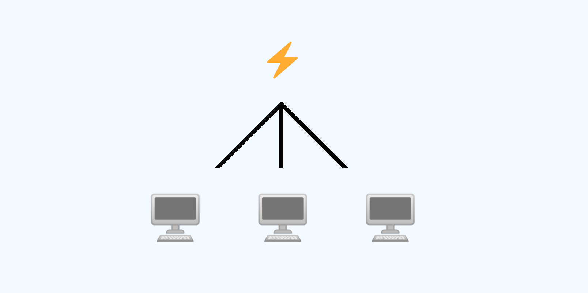

<h1 align="center">Welcome to Snapshot Public Router 👋</h1>



<p>
  
  <a href="https://twitter.com/pi0neerpat" target="_blank">
    
  </a>
</p>

<!-- ALL-CONTRIBUTORS-BADGE:START - Do not remove or modify this section -->

[](#contributors-)

<!-- ALL-CONTRIBUTORS-BADGE:END -->

> Forward events from Snapshot to your app
>
> >

### 🏠 [Homepage](https://snapshot.collab.land/)

## Add your App

Please add your app to `approvedAppList.js`

## Install

```sh
yarn install
```

## Usage

```sh
vercel dev
```

## Testing

Send requests using the Postman the collection `snapshot.postman_collection`

## Going to Production

1. Pull the latest snapshot spaces

```bash
# Within this repo
git clone git@github.com:bonustrack/snapshot-spaces.git

node scripts/importSpaces
```

2. Deploy by merging Pull Request to master

## Author

👤 **Patrick Gallagher**

- Website: https://patrickgallagher.dev
  - Twitter: [@pi0neerpat](https://twitter.com/pi0neerpat)
  - GitHub: [@pi0neerpat](https://github.com/pi0neerpat)

## Show your support

Give a ⭐️ if this project helped you!

---

_This README was generated with ❤️ by [readme-md-generator](https://github.com/kefranabg/readme-md-generator)_
